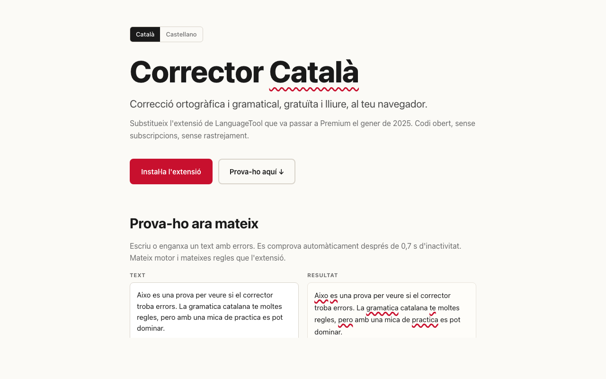

# Corrector Català

> Correcció ortogràfica i gramatical en català (i castellà), gratuïta i lliure, al teu navegador. Substitueix l'extensió de LanguageTool que va passar a Premium el gener del 2025.

<p align="center">
  <a href="https://corrector.damosenelblanco.com/">
    <picture>
      <source media="(prefers-color-scheme: dark)" srcset="docs/screenshots/landing-dark.png">
      
    </picture>
  </a>
</p>

<p align="center">
  <strong><a href="https://corrector.damosenelblanco.com/">Prova-ho al web</a></strong> ·
  <a href="https://corrector.damosenelblanco.com/extension.zip">Descarrega l'extensió</a> ·
  <a href="https://corrector.damosenelblanco.com/privacy.html">Privadesa</a>
</p>

---

## Què fa

- Subratlla errors d'ortografia i gramàtica mentre escrius — a `<textarea>`, camps de cerca, comentaris, composers (Reddit, Twitter, Gmail, WhatsApp Web…).
- **Detecta automàticament la variant**: estàndard, valencià, balear, o castellà. També es pot triar manualment per origen.
- **Privat per disseny**: no usa cap analítica, cookies de tercers, ni rastrejadors. El text només va al servidor que tu trïis.
- **Diccionari personal** i **llista de dominis desactivats**, sincronitzats entre dispositius.
- **Mode fosc** automàtic.
- Codi obert AGPLv3.

## Com funciona

L'extensió captura el text, l'envia per HTTPS al servidor de [LanguageTool](https://languagetool.org) (autohostat per Damos en el Blanco a `corrector.damosenelblanco.com`), i renderitza els subratllats amb el [CSS Custom Highlight API](https://developer.mozilla.org/en-US/docs/Web/API/CSS_Custom_Highlight_API) (per a `[contenteditable]`) o amb un mirror posicionat (per a `<textarea>`/`<input>`).

```
┌─────────────────┐         ┌──────────────────┐         ┌──────────────┐
│ Content script  │ message │ Service worker   │  HTTPS  │ corrector.   │
│ (per pestanya)  │────────▶│ (background)     │────────▶│ damosenel    │
│ - editors       │  Match[]│ - cau LRU        │  JSON   │ blanco.com   │
│ - subratllats   │◀────────│ - debounce/abort │◀────────│ (LT)         │
└─────────────────┘         └──────────────────┘         └──────────────┘
```

Detalls tècnics complets a [`docs/ARCHITECTURE.md`](docs/ARCHITECTURE.md).

## Instal·lació

| Per a què? | Vegeu |
|---|---|
| Usuaris finals (Chrome/Edge/Brave) | [`docs/INSTALL.md`](docs/INSTALL.md) o **[descarrega directe](https://corrector.damosenelblanco.com/extension.zip)** |
| Autohostar el teu propi servidor LanguageTool | [`docs/INSTALL_SERVER.md`](docs/INSTALL_SERVER.md) (Docker + nginx, ~5 minuts) |
| Notes de la producció actual a `corrector.damosenelblanco.com` | [`docs/DEPLOYMENT_NOTES.md`](docs/DEPLOYMENT_NOTES.md) |
| Política de privadesa | [`docs/PRIVACY.md`](docs/PRIVACY.md) o el [web](https://corrector.damosenelblanco.com/privacy.html) |

## Desenvolupament

Cal Node ≥ 20 i `pnpm`.

```bash
git clone https://github.com/humbertblanco/correctorcatala.git
cd correctorcatala
pnpm install

pnpm dev               # arrenca Chromium amb hot-reload de l'extensió
pnpm build             # build de producció
pnpm test              # tests del detector de variant (vitest)
pnpm zip               # genera el ZIP per pujar al Chrome Web Store
```

Per al servidor:

```bash
cd server
cp .env.example .env   # edita DOMAIN i EMAIL_FOR_LE
./scripts/bootstrap.sh # mode standalone (VPS net)
# o:
./plesk/plesk-deploy.sh # mode Plesk co-tenant (vegeu DEPLOYMENT_NOTES)
```

## Estat del projecte

- ✅ Backend en producció a `https://corrector.damosenelblanco.com`
- ✅ Extensió Chrome MV3 funcional (Catalan + Castellà)
- ✅ Landing pública (CA + ES) amb demo en viu
- ✅ Tests automatitzats per al detector de variant
- ⏳ Submissió al Chrome Web Store
- ⏳ Build de Firefox

Vegeu [CHANGELOG.md](CHANGELOG.md) per a l'històric complet.

## Agraïments

Construït sobre:

- [**LanguageTool**](https://languagetool.org) — el motor de correcció (LGPL 2.1).
- [**Softcatalà**](https://softcatala.org) i la comunitat — mantenidors de les regles catalanes a LanguageTool i del [`catalan-dict-tools`](https://github.com/Softcatala/catalan-dict-tools).
- [**erikvl87/docker-languagetool**](https://github.com/Erikvl87/docker-languagetool) — la imatge Docker que utilitzem.
- [**WXT**](https://wxt.dev) — framework d'extensions modernes per a MV3.

Servidor i hosting cortesia de [**Damos en el Blanco**](https://damosenelblanco.com) — agència creativa i tecnològica a Barcelona.

## Llicència

[AGPLv3](LICENSE). Si fas servir el codi del servidor en un servei accessible per xarxa, has de publicar les teves modificacions sota la mateixa llicència. L'extensió és independent (no enllaça LT, només crida la seva API HTTP) i pot ser usada lliurement.

## Contribuir

Vegeu [`docs/CONTRIBUTING.md`](docs/CONTRIBUTING.md). PRs benvinguts: noves regles via Softcatalà, adapters per a editors moderns (ProseMirror, Slate, Lexical), millores a la detecció de variant.
